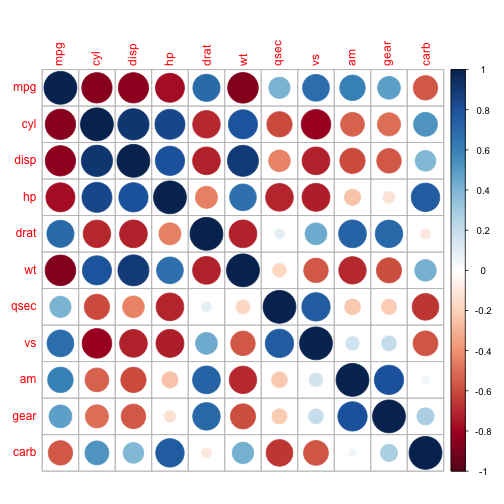

Correlation Matrix in Shiny with corrplot
========================================================
author: Forest
date: 9-18-2014

What is Correlation
========================================================

>In statistics, **dependence** is any statistical relationship between two random variables or two sets of data. **Correlation** refers to any of a broad class of statistical relationships involving dependence.

[Correlation](http://en.wikipedia.org/wiki/Correlation_and_dependence) is one of the most commonly used metrics to depict statistical relationships between two variables. It's often used in exploratory analysis, feature selection and many other modelling steps.

How to Visualize Correlation in R
========================================================


```r
pairs(mtcars)
```

 
***


```r
corrplot(cor(mtcars))
```

 


Problems?
========================================================

- While the `pairs` function is very powerful when the data dimension is low, it's much more difficult to see things when you have a lot of variables.
- `corrplot` is an excellent function but it has so many arguments that mastering it could be overwhelming:

```r
str(corrplot)
```

```
function (corr, method = c("circle", "square", "ellipse", "number", 
    "shade", "color", "pie"), type = c("full", "lower", "upper"), 
    add = FALSE, col = NULL, bg = "white", title = "", is.corr = TRUE, 
    diag = TRUE, outline = FALSE, mar = c(0, 0, 0, 0), addgrid.col = NULL, 
    addCoef.col = NULL, addCoefasPercent = FALSE, order = c("original", 
        "AOE", "FPC", "hclust", "alphabet"), hclust.method = c("complete", 
        "ward", "single", "average", "mcquitty", "median", "centroid"), 
    addrect = NULL, rect.col = "black", rect.lwd = 2, tl.pos = NULL, 
    tl.cex = 1, tl.col = "red", tl.offset = 0.4, tl.srt = 90, cl.pos = NULL, 
    cl.lim = NULL, cl.length = NULL, cl.cex = 0.8, cl.ratio = 0.15, 
    cl.align.text = "c", cl.offset = 0.5, addshade = c("negative", 
        "positive", "all"), shade.lwd = 1, shade.col = "white", p.mat = NULL, 
    sig.level = 0.05, insig = c("pch", "p-value", "blank", "n"), pch = 4, 
    pch.col = "black", pch.cex = 3, plotCI = c("n", "square", "circle", 
        "rect"), lowCI.mat = NULL, uppCI.mat = NULL, ...)  
```

Solution! 
========================================================

https://saurfang.shinyapps.io/shinyCorrplot

This interactive Shiny application provides access to most exmaple use in `corrplot`'s excellent [vignette](http://cran.r-project.org/web/packages/corrplot/vignettes/corrplot-intro.html). It also lets you upload your own dataset, reorder the columns manually, and take a quick peak on the underlying dataset itself.


And, last but not least:

![Don't Forget] (http://imgs.xkcd.com/comics/correlation.png)
